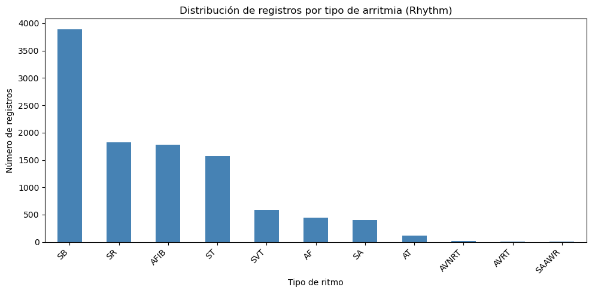
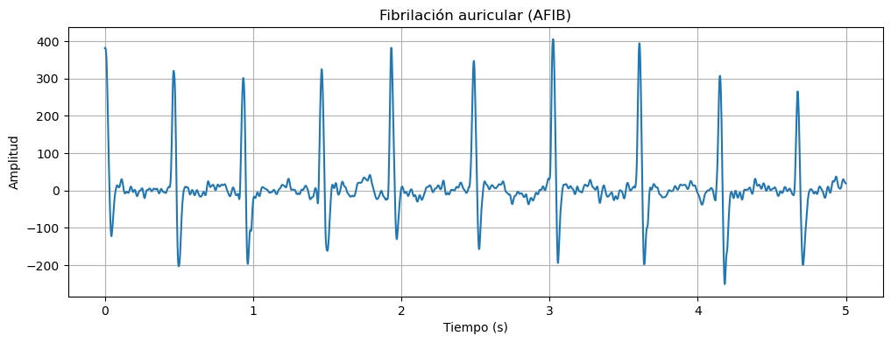
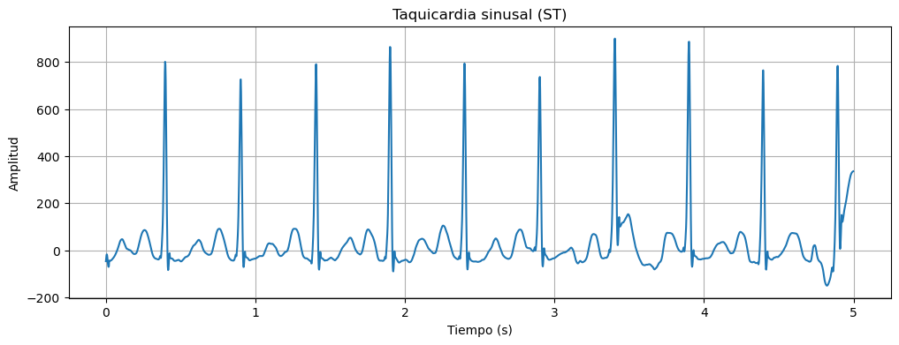

En esta segunda parte de la práctica, trabajamos con una amplia base de datos de señales de electrocardiograma (ECG). El primer paso consistió en realizar una exploración general de los archivos para comprender la estructura de la información suministrada. Para ello, identificamos el número total de registros, los tipos de arritmias disponibles y la cantidad de sujetos por grupo, así como las derivaciones (canales), la frecuencia de muestreo y la duración temporal de los registros.

Posteriormente, seleccionamos dos tipos específicos de arritmias para graficarlas y analizar su comportamiento, observando aspectos como la morfología de la señal, la amplitud y la regularidad de los latidos. A partir de estas señales, realizamos un análisis descriptivo extrayendo variables estadísticas clave para cada paciente: calculamos la media, la desviación estándar, los valores máximos y mínimos, la frecuencia cardíaca (FC) y el valor RMS.

Finalmente, el objetivo principal era realizar un análisis estadístico comparativo riguroso entre ambos grupos de arritmias. Para lograrlo, formulamos una hipótesis nula y una alternativa. Antes de comparar los grupos directamente, debíamos comprobar los supuestos estadísticos para decidir qué prueba aplicar: verificamos la normalidad de las variables (usando la prueba de Shapiro-Wilk) y la homocedasticidad o igualdad de varianzas (mediante la prueba de Levene). La instrucción de la guía era clara: si los datos cumplían con los supuestos, utilizaríamos una prueba paramétrica como la t de Student para muestras independientes; si no los cumplían, debíamos recurrir a un análisis no paramétrico aplicando la prueba U de Mann-Whitney.

1. Exploración y descripción de la base de datos

La base de datos utilizada está compuesta por registros electrocardiográficos (ECG) y un archivo de diagnóstico asociado. En total, se encontraron 10646 registros, correspondientes a archivos individuales de ECG. El archivo Diagnostics.xlsx presenta una dimensión de 10646 filas y 16 variables, entre las que se encuentran el tipo de ritmo, características del paciente y diferentes parámetros electrocardiográficos.

Cada registro de ECG contiene 12 canales, correspondientes a las derivaciones estándar: I, II, III, aVR, aVL, aVF, V1, V2, V3, V4, V5 y V6. La frecuencia de muestreo utilizada es de 500 Hz, con aproximadamente 4999 muestras por registro, lo que corresponde a una duración aproximada de 9,998 segundos.

La variable Rhythm permitió identificar los diferentes tipos de ritmo presentes en la base de datos y establecer la distribución de los registros entre las diferentes clases. Esta distribución se presentó mediante una gráfica de barras, con el propósito de visualizar la cantidad de registros pertenecientes a cada tipo de ritmo. De estas clases, se destacan para el análisis posterior: AFIB (Fibrilación auricular): 1780 registros, y ST (Taquicardia sinusal): 1568 registros

El resto de clases presentes (visibles en la Tabla 1 y el gráfico de barras generados en el notebook) muestran que la base de datos está desbalanceada, es decir, no todas las arritmias tienen un número similar de registros, lo cual debe tenerse en cuenta al interpretar comparaciones estadísticas entre grupos y al considerar un eventual uso de estos datos para clasificación automática.

                            | Ritmo	   |  Numero_de_registros |	Porcentaje (%) |
                            |----------|----------------------|----------------|
                    |0	    |SB	       | 3889	              |    36.53|
                    |1	    |SR	       | 1826	              |    17.15|
                    |2	    |AFIB	   | 1780	              |    16.72|
                    |3   	|ST	       | 1568	              |    14.73|
                    |4	    |SVT	   | 587	              |    5.51|
                    |5	    |AF	       | 445	              |    4.18|
                    |6	    |SA	       | 399	              |    3.75|
                    |7	    |AT	       | 121	              |    1.14|
                    |8	    |AVNRT	   |  16	              |    0.15|
                    |9	    |AVRT	   |   8	              |    0.08|
                    |10	    |SAAWR	   |   7	              |    0.07|

 Figura 1.(Distribución de los registros de ECG según el tipo de ritmo.)

2. Visualización y caracterización de las señales

Para esta etapa se seleccionaron dos tipos de ritmo: fibrilación auricular (AFIB) y taquicardia sinusal (ST). La base de datos contiene 1780 registros clasificados como AFIB y 1568 registros clasificados como ST.

La fibrilación auricular es una arritmia caracterizada por una actividad auricular desorganizada. En el electrocardiograma suele observarse una respuesta ventricular irregular y ausencia de ondas P claramente diferenciadas, en su lugar, la línea de base se ve temblorosa o con pequeñas ondas caóticas; Los espacios o intervalos entre cada latido (intervalos R-R) cambian de forma constante y sin ningún patrón predecible y  los picos de los latidos (QRS) suelen mantener una forma normal o estrecha, pero aparecen a distancias completamente desordenadas [1]. Por otra parte, la taquicardia sinusal corresponde a un ritmo originado en el nodo sinusal, con ondas P normales antes de cada QRS, pero con frecuencia cardíaca elevada (>100 lpm) y ritmo regular [2].

Para la visualización se seleccionó un registro de cada grupo y se utilizó la derivación II, debido a que permite observar de manera adecuada la actividad eléctrica cardíaca. Ambos registros contienen 12 derivaciones y aproximadamente 5000 muestras, correspondientes a cerca de 10 segundos de señal.

 Figura 2. Registro ECG correspondiente a fibrilación auricular (AFIB), derivación II.

 Figura 3. Registro ECG correspondiente a taquicardia sinusal (ST), derivación II.

A partir de la visualización de los registros seleccionados se pueden identificar diferencias en la morfología, amplitud, frecuencia cardíaca y regularidad de los latidos entre la fibrilación auricular (AFIB) y la taquicardia sinusal (ST). En el registro correspondiente a ST se identifican ondas P consistentes antes de cada complejo QRS, manteniendo la organización característica del ritmo sinusal. En contraste, en el registro de AFIB no se observan ondas P claramente definidas, sino una línea de base con oscilaciones irregulares, mientras que el complejo QRS mantiene una forma relativamente estable.

En cuanto a la amplitud, ambas señales presentan valores del mismo orden de magnitud. Sin embargo, el registro de AFIB presenta una mayor variabilidad entre los diferentes latidos, asociada a las oscilaciones irregulares presentes en la línea de base. Esta variabilidad permite diferenciar visualmente el comportamiento de la señal de AFIB respecto al patrón más organizado observado en ST.

Respecto a la frecuencia cardíaca, el registro de ST presenta una frecuencia cardíaca más alta que el registro de AFIB, lo cual es consistente con las características propias de la taquicardia sinusal, en la que se conserva el ritmo sinusal pero con una frecuencia elevada. Finalmente, se observa una diferencia importante en la regularidad de los latidos. El registro de AFIB presenta una mayor dispersión de los intervalos R-R, reflejada en una desviación estándar de estos intervalos superior a la observada en ST. Esto confirma cuantitativamente el patrón irregular característico de la fibrilación auricular, mientras que los intervalos R-R del registro de ST presentan una menor variabilidad y, por tanto, un ritmo más regular.

En conjunto, las características observadas en las señales permiten diferenciar ambos tipos de ritmo. La ausencia de ondas P claramente definidas y la irregularidad de los intervalos R-R son características destacadas del registro de AFIB, mientras que la presencia de ondas P antes de cada QRS y una mayor regularidad de los intervalos R-R son consistentes con el registro de taquicardia sinusal.

3. Análisis estadístico entre arritmias
   
Para llevar a cabo el análisis estadístico comparativo entre la fibrilación auricular (AFIB) y la taquicardia sinusal (ST), se definieron inicialmente las hipótesis de trabajo. La hipótesis nula (H0) establece que no existen diferencias significativas en las características descriptivas (media, desviación estándar, valor máximo, valor mínimo, frecuencia cardíaca y valor RMS) entre los dos tipos de arritmias. Por el contrario, la hipótesis alternativa (H1) plantea que sí existen diferencias estadísticamente significativas en dichos parámetros entre ambos grupos.

Antes de seleccionar la prueba estadística a implementar, fue indispensable verificar los supuestos requeridos para el uso de pruebas paramétricas, específicamente la t de Student. Utilizando la prueba de Shapiro-Wilk para evaluar la normalidad de las variables en cada grupo, se obtuvieron p-valores notablemente inferiores a 0.05. De igual manera, se aplicó la prueba de Levene para analizar la homocedasticidad (igualdad de varianzas), la cual arrojó p-valores muy por debajo del nivel de significancia del 5%.

Al confirmarse estadísticamente que los datos no siguen una distribución normal y que las varianzas no son homogéneas, se descartó el uso de la prueba t de Student. En su lugar, el diseño experimental requirió la aplicación de la prueba U de Mann-Whitney, el cual es el método no paramétrico idóneo para comparar diferencias entre dos muestras independientes que no cumplen con los supuestos de normalidad [3].

| Variable   | Prueba       | Estadístico | p-valor       | Decisión    |
                            |------------|--------------|-------------|---------------|-------------|
                    |0      |Media       | Mann-Whitney |   1297200.0 |  4.269913e-04 | Rechazar H0 |
                    |1      |Desviacion  | Mann-Whitney |   1049159.0 |  2.301105e-35 | Rechazar H0 |
                    |2      |Maximo      | Mann-Whitney |   1286645.5 |  9.580237e-05 | Rechazar H0 |
                    |3      |Minimo      | Mann-Whitney |   1484816.5 |  1.376665e-03 | Rechazar H0 |
                    |4      |FC          | Mann-Whitney |    744694.5 | 2.829111e-120 | Rechazar H0 |
                    |5      |RMS         | Mann-Whitney |   1059891.0 |  2.605043e-33 | Rechazar H0 |

REFERENCIAS 
[1] “Atrial Fibrillation”. Life in the Fast Lane • LITFL. Accedido el 27 de septiembre de 2026. [En línea]. Disponible: https://litfl.com/atrial-fibrillation-ecg-library/

[2] “Taquicardia sinusal: qué es y mecanismo | Diccionario CUN,” https://www.cun.es. https://www.cun.es/diccionario-medico/terminos/taquicardia-sinusal

[3] R. E. Walpole, R. H. Myers, S. L. Myers, y K. Ye, Probabilidad y estadística para ingeniería y ciencias, 9a ed. México: Pearson Educación, 2012.
